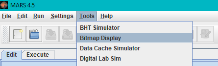

This project was made for the computer architecture 2021 class

# 🗒️ Requirements

In this MIPS project we must achieve the equivalent of structures in languages C, implement the equivalent of C's 'printf' function and be able to save our structures in a file and read the data from this file saved.
As an application we will model the structures C representing cars. 

The Car structure must include the following information:

1. Name of up to 16 characters, eg. : BMW, Porsche, ...
2. Pattern of up to 16 characters, eg. : X6, 325i, Panamera, 911,718 Boxster, ...
3. Year of manufacture, eg. : 2009, 2018, ...
4. Number of cylinder, eg. : 4, 6, 8, ...
5. Number of fiscal horses, eg. : 20, 30, ...
6. Convertible: true or false


The program should be able to accomplish the following tasks:

1. declare an array of structures
2. fill it by reading the user data
3. display
4. save it to a file
5. read from this file to fill in the table

# 🧰 Usage

When you run the program it will ask for an `integer` this integer represent the number of cars that array will contain.

The array size is calculated using the integer you read multiplied with `48` , `48` is the size of the car struct calculated as follow `16*2+4*4 = 32+16 = 48`  `16` for each string , and `4` for each integer we read. 


after that a Menu will appear


1. will add a new car to the array (if maximum number of cars reached you can't add more cars)
2. will append the saved data in a file to the end of the Array. (if array is full it will stop reading from the file)
3. save the car , will save the data in the Array into a file so you can load it later.
4. display all the data in the array.
5. graceful exit from program

`2-3` will ask you to provide the full path of the file

`example on Windows : C:\Users\Administrator\Documents\University_codes\I2207\project\cars.dump` 

`example on Linux : /home/omar/Documents/University_codes/I2207/project/cars.dump` 

**NOTE** printing is done using c-like `printf` implementation so it's little bit slower than normal printing

# 🖌️ printf

`printf` will take as parameter at maximum `3`

```
$a0 : contain the formatting string
$a1 : contain the first data of formated
$a2 : contain the second data of formated
$a3 : contain the third data of formated
```

example : 

```assembly
str: .asciiz "Car name : %s\nCar Model : %s\nYear : %d\n"
la $a0,str
la $a1,carName
la $a2,carModel
lw $a3,carYear
jal printf 
# jal printf will store current instruction pointer to $ra so you can continue from the point after you return from the call

.include "printf.asm"
```

it's safer to include it in the end of the file using

# Palestine


Palestine program is not asked for the project , but I do it as a support for Palestine

to see the result

press `tools > Bitmap display`



setup program for

```
Unit width in Pixels : 16
Unit height in Pixels : 16
Display width in Pixels : 512
Display height in Pixels : 256
Base address for display : 0x10008000 ($gp)
```

 

then press `connect to MIPS` and then open source code compile it and run it while `Bitmap Display` is open and the result will appear in the black rectangle on screen.

